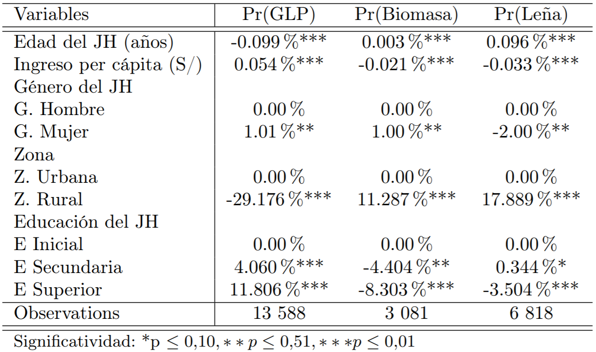

## Nota

Mi teclado esta en ingles^[Por lo que existira omisiones de tildes o caracteres que solo existe en el teclado espanol]

Algunas correciones se puede hacer en: [https://github.com/TJhon/notas-de-clase/blob/master/notas.Rmd]

Aplicacion Osinergmin^[los resultados del modelo estan siendo revisados por mi profesor]


# Cuestiones Generales

- Superviciones
  - Preoperativa: revision de contratatos(no vinculante)
  - Operativa: hacer cumplir el contrato
  
- Juridiccion
  - Seguridad tecnica (2011)
  - Seguridad laboral - SUNAFIL
  - Seguridad Ambiental - OEFA

- Economia de densidad
- Integracion  vertival
- Mercados relevantes
- Concetacion de mercados(Lerner)

---
- Incetidumbre 
- Informacion asimetrica
  - Informacion oculta
  - Accion oculta 
  - Renta informacional
- Poder de mercado 

- Monopolios (1 3 2) - (perfecta, clustering, autoseleccion)
- Restricciones y fusiones verticales (Descuentos, clausulas de exclusividad) 
  - Interbrand
  - Intrabrand
- Tierras raras

# Sectores 

## Hidrocarburos


- Upstream (Exploracion, Produccion) Derechos de lotes ^[En general 10$ MM] - Monopolios legales
- Midstream (Transporte, almacenamiento)  
- DonwStream 
  - Refinacion (Petroperu) - Monopolio Legal
  - Comercializacion [Mayoristas, Plantas de abastecimiento]) Oligopolios

## Gas Natural

Consorcio Camisea, lotes 56 88 (82%) ^[GLN Enfriamiento del gas para transporte] 

- Upstream (Exploracion, Produccion) Derechos de lotes {Comprobados, potenciales}
- Midstream (Transporte, almacenamiento, distribucion) - Monopolios naturales
- DonwStream 
  - Comercializacion Centrales electricas, distribuidoras, clientes industriales (92%) [Minimo de conexiones- contraparte del estado]
    - En inicios clientes asegurados, con precios decrecientes
  
## Electricidad


- Economias a escala - Costos decrecientes
- Clientes Libres (empresas industriales 0.2 MW)
  - Las partes establecen un precio
- Clientes regulados
  - Tarifas 
- Cargos, recargos , subenciones

--- 

### Generacion

- Potencialmente Competetivia 
- Entrada al menor costo
  - Hidroelectricas, gas natural, hidrocarburo 
- Tarifas en barra, largo plazo, cada anio, (energia y potencia)

--- 

### Operacion del sistema 

COES - Monopolio legal

### Transimision

- Monopolios naturales
- Licitaciones
- Empresa modelo eficiente
- Transmision garantizada y complementaria


### Distribucion y Comercializacion

- Modelo de empresa modelo eficiente, costos de inversion, operacion y mantenimiento (4 anios)
- Distribucion - Monopolio natural
- Comercializacion Minorista - Potencialmente competitiva^[Servicio al cliente]


## Mineria

| Inversiones proyectadas al 2020 fueron de 6.7$ MM 
| Intensivas en capital
| Proyecciones de precios a corto y mediano plazo

- Exploracion - Libre 
- Explotacion - Permisos legales
- Plantas de beneficios (solo se aprovecha el 4% )
- Transporte 

# Modelos


## Hotelling

Royalty

- Produccion 

$$\int_{0}^{T}[PQ(1-\tau) - CT]e^{-rt} dt $$
$${\dot{P (1-\tau) - c }}>= r$$ ^[$c$: costo marginal]

Trayectoria optima, relacion con los precios

---

- Utilidades

$$\int_{0}^{T[}[PQ - CT]](1-\tau)e^{-rt} dt $$


$${\dot{(P  - c )(1-\tau)}} = r$$


Reduce el valor del yacimiento, desincentiva animos de prospecciones


## Precios tope

$$\Pi = IT - CT $$ 

Empresas ^[difereciales totales, divides, defines un factor de productividad, estableces relaciones diferenciales ], Economia ^[Lo mismo, restas con el de la empresa y se obtiene el factor de productividad]

$$\dot{P} = \dot{P_E} - X $$

$$X = -(Ip - Ip_E)   - (\dot{W} - \dot{W_E})$$

Nota^[Osiptel fue el primero en aplicar este modelo, y me aburre usar excel]

## Otros modelos 

- Tasa de retorno - sobrecapitalizacion
- costos incrementales - servicios adicionales 
- Empresa modelo eficiente - empresa teorica(osinergmin)
- Disposicion a pagar
- Otros^[Queria aplicar otros modelos, pero el tiempo de explicar seria muy amplio, si se desea ver los modelos revisar en Osinergmin, GPAE] 


# Aplicacion 

## Modelo 

Expresion 

$$
P_{il} = P_{iT} * P{il|T} = \frac{\epsilon^{\frac{Vl}{\lambda}}[\sum_{k=1}^2\epsilon^{\frac{V_l}{\lambda}}]^{\lambda_T - 1}}
{\sum_{k=1}^2[\epsilon^{\frac{V_l}{\lambda}}]^\lambda{_T} + \epsilon^{V_{GLP}}}
$$


```{r, mysize = TRUE, size = "\\tiny", echo=FALSE}
knitr::knit_hooks$set(mysize = function(before, options, envir) { 
  if (before) { 
    return(options$size) 
  } else { 
    return("\\normalsize") 
  } 
}) 
knitr::opts_chunk$set(mysize = TRUE, size = "\\tiny")
```

```{r, mysize = TRUE, size = "\\tiny", echo=FALSE, warning=FALSE, message=FALSE}
library(tidyverse); library(stargazer); library(mlogit)
# Sistema de calefaccion y refrigeracion 
lima <- readRDS('dr/muestralima.rds')
lima <- mlogit.data(lima, varying = c(2:8, 10:16), choice = "depvar", shape = "wide")
sitema_doble <- index(lima)$alt %in% c('gcc', 'ecc', 'erc', 'hpc') # los dos sistemas
calefaccion <- index(lima)$alt %in% c('erc', 'er') # solo calefaccion
# costos de operacion de instalacion y costos de opracion solo son relevantes
# para el sistema doble
 ## ich: costos de instalacion
 ## och: costos operativos
lima$icca[!sitema_doble] <- 0 # instalacion 
lima$occa[!sitema_doble] <- 0 # operacion
# create ingreso variables for two sets cooling and rooms
lima$ing_doble <- lima$simple <- 0
lima$ing_doble[sitema_doble] <- lima$ingreso[sitema_doble]
lima$simple[calefaccion] <- lima$ingreso[calefaccion]
# interepto para la eleccion
lima$int_doble <- as.numeric(sitema_doble)
# modelo con un solo nudo
nl <- mlogit(depvar ~ ich + och +icca + occa + simple + ing_doble + int_doble | 0, lima,
             nests = list(cooling = c('gcc','ecc','erc','hpc'), 
                          other = c('gc', 'ec', 'er')), un.nest.el = TRUE)
nl2 <- update(nl, nests = list(central = c('ec', 'ecc', 'gc', 'gcc', 'hpc'), 
                               room = c('er', 'erc')))
nl3 <- update(nl, nests=list(n1 = c('gcc', 'ecc', 'erc'), n2 = c('hpc'),
                             n3 = c('gc', 'ec', 'er')))
str_t <- function(x, y){
    stargazer(x, type = ifelse(y == "t", "text", "latex"), header = FALSE)
}
str_t
```

---

```{r, mysize = TRUE, size = "\\tiny", echo=FALSE, results='asis'}
stargazer(nl, nl2, nl3, type = 'latex', header = FALSE, dep.var.labels = "Elecciones", single.row=TRUE)
```

Estimaciones con este tipo de modelos [https://www.sciencedirect.com/science/article/abs/pii/0047272774900036]


# Aplicacion osinerming

Econometria bayesiana^[Elemental segun mi profe]

Los datos me fueron prestados 
para poder actualizar los resultados^[Si mi profe lo acepta]

--- 

Perdon^[Da flojera escribir todo] 

### Titulo

Escalera energetica Peru

### Problema

- Politicas de acceso a energia (GLP)
  - FISE (subencions de los costos variables)
  - Cocina Peru (kit de cocina GLP)
  
### Hipotesis

- Variables socioeconomicas y demograficas generan una influencia positiva en la eleccion del GLP como combustible prncipal

---

### Modelo

El modelo a estimar

$$
\begin{aligned}
V_{GLP} &= \alpha + \beta_0EduJH + \beta_1Zona  + \beta_2 INGpc + \\
&\quad \beta_3P_{GLP} + \beta_4P_{lea} + \beta_5GenJH + \beta_6 EdadJH + e
\end{aligned}
$$

Donde $\lambda_{T-1}$ medida de asociacion entre las alternativas disponibles, V_{GLP} nivel de utilidad al elegir GLP,  EduJH, EdadJH y GenJH representan el nivel edu-cativo, la edad y género del jefe del hogar, Zona identifica la ubicación geográfica, INGpc es el ingreso per cápita y P_{GLP} es el precio


---

## Datos 

Modulos 01, 02, 34

## Resultados



## FIN
